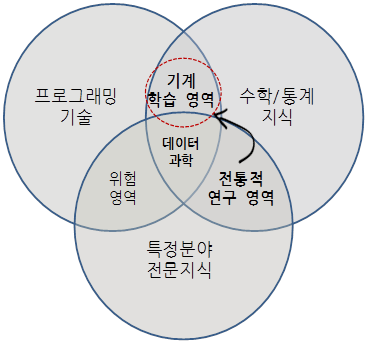
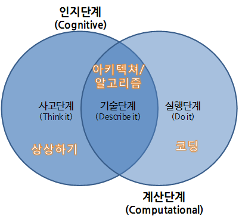

### 데이터 과학 (Data Science)

자연법칙은 변수(Variable), 관측점(Observation), 값(Value)으로 구성된다. 변수는 측정한 정량 혹은 정성적 특성이 되고, 값은 측정한 시점에 변수의 상태이며, 관측점은 유사한 조건하에 측정한 여러 변수값 집합이다. 자연법칙은 동일한 관측점 값에 적용되어 동작하는 변수를 다룬다. 따라서, 자연법칙은 데이터에 **패턴(pattern)**으로 나타난다. 

변수, 관측점, 값으로 구성된 데이터를 가지고 있지만 현실 세계를 움직이는 자연법칙을 모른다면 패턴을 찾아서 자연법칙을 모사할 수 있고, 현실 세계에 대한 자연법칙을 찾았다면 데이터를 통해서 확증하는 것도 가능하다.

현재도 그렇지만, 향후 통계학은 컴퓨터 과학과 밀접한 관계를 갖고 지속적으로 발전해 나갈 것으로 예상된다. 사실 통계학 뿐만 아니라 다른 모든 학문 분야가 `Computation-X` 라는 이름으로 진화되고 있다. 예를 들면, 컴퓨터 생명공학(Computational Biology), 계산 통계학(Computational Statistics), 계산 물리학(Computational Physics), 컴퓨터 화학(Computational Chemistry) 등 수많은 사례를 들 수 있다. 2010년 쟈넷 윙 교수의 조사에 따르면 거의 모든 학문 분야가 컴퓨터와 연관이 되고 있으며 컴퓨터를 적극 활용하여 과학기술, 인문, 사회, 법과 제도 등에서 광범위한 융합이 나타나고 있다고 주장했다.

출처: Jeannette Wing (2010), Computational Thinking: What and Why?, Carnegie Mellon University

통계학도 기존 수학 및 이론 통계를 중심에 두고 컴퓨터를 접목하려는 시도도 있지만, 컴퓨터 과학  중심에서 통계학을 접근하는 움직임도 확연히 나타나고 있다. 동일한 통계학을 서로 다른 방식으로 살펴보고 학습할 수 있는 수많은 사례 중 하나를 소개한다. 구글 데이터 과학자, David Diez가 중심이 된 무료 통계 교육 [OpenIntro](https://www.openintro.org/) 접근방법과, 컴퓨터 과학에 뿌리를 두고 있는 올린공대 Allen B. Downey 교수의 [Think Stats](https://www.openintro.org/) 접근법이 좋은 사례가. 하지만, 두가지 접근 방법 모두 무료로 원본 저작파일을 비롯하여 다양한 형태의 온라인 교재(PDF 등)를 저작권 걱정없이 다운로드 받을 수 있고 실생활과 밀접한 데이터를 가지고 R, SAS, 파이썬 등 소프트웨어를 가지고 직접 실행도 해볼 수 있으며, 저자가 해석한 결과를 독자가 해석한 결과와 비교하여 감상할 수도 있고, 모두 공개된 통계교육 방법을 취하고 있다는 점에서는 지향점도 유사하고, 공통점도 많다.

## 데이터 과학과 소프트웨어

최근 통계학은 컴퓨터를 따로 떼어놓고 생각하거나, 독립적인 통계 프로젝트를 진행하는 것을 상상할 수 없다. 하다못해 워드 프로세서나 엑셀 같은 사무자동화 소프트웨어가 없는 사무실, 혹은 구글이나 네이버 검색서비스 없는 대한민국을 상상하기는 어렵다.

콘웨이는 수학/통계학 지식, 프로그래밍 기술, 특정분야 전문 지식을 총괄한 것이 **데이터과학(Data Science)**이라고 정의했다. 과거 특정분야 전문지식에 수학/통계학 지식을 접목한 것이 전통적 연구 영역이라면 이제 프로그래밍 기술을 더한 기계학습 영역도 함께 접목해 나가야 진정한 데이터과학이라고 할 수 있다. 

하지만 지금까지 현실은 통계학을 배우고 학습하는 경우 대부분 통계이론을 배우고 바로 엑셀, 미니탭/SAS/SPSS/R/파이썬/자바 같은 통계 팩키지나 프로그래밍 언어로 바로 실습에 들어간다. 그러다 보니 준비운동을 충분히 않고 수영, 축구, 농구, 볼링같은 본 운동에 바로 들어가는 것과 같은 부작용이 나타난다. 통계학도 쉽지 않은 개념인데 컴퓨터를 활용하여 실습을 하게 되니 학생들의 뇌는 너무나 많은 부하를 견뎌야 하는 상황에 직면하여 고생은 많이 하지만 실제 학습 성과는 좋지 못한 경우를 종종 볼 수 있다.

가르치는 사람도 컴퓨터 소프트웨어를 제대로 배워본 적이 없고, 배우는 학생도 마찬가지니 정말 심각한 문제가 아닐 수 없다. 하지만, 이런 문제는 선진국에서 수십년 전부터 목도하고 준비하여 최근에는 다양한 콘텐츠와, 교수법, 교사가 양성되어 저변에 많은 준비가 되어 있다. 전산학 전공자를 제외한 일반 사용자 통계학이나 데이터과학에 기반한 누구나 컴퓨터과학 언플러그드, 정보교육을 위한 파이썬, 소프트웨어 카펜트리에서 제시하고 있는 무료 컴퓨터 교육 과정을 따라 학습해보는 것도 시작하기에 부담이 없다.

출처: Hadley Wickham "dplyr" talk, at useR 2014

최근 가장 영향력있는 통계 소프트웨어 분야 스타인 Hadley Wickham은 데이터 과학을 인지단계(Cognitive)와 계산단계(Computational)로 구분하고, 인지단계에서 문제를 파악하고, 문제를 기술하고, 접근법을 정리하고 나서 계산단계에서 소프트웨어 아키텍처와 알고리즘을 설계하고 실제 구현 코딩을 하는 과정을 제시하고 있다.

특정분야의 전문지식을 배경으로 왜(Why)하는가 하는 동기를 부여받고, 이를 실제 소프트웨어 코드를 통해서 구현하고, 피드백을 받는 일련의 과정은 단속적이며 서로 독립적으로 구분되는 과정이 아니라, 추상적 사고와 자동화를 근간으로 하고 있는 컴퓨터적 사고와 밀접한 관련이 있으며 데이터를 다루는 통계학과 데이터 과학도 필히 내재화 해야하는 필수 요소다.

### 통계적으로 생각하기 (Think Stats)

생각하기 시리즈로 유명한 Allen B. Downey 교수님의 저서 중에 `통계적으로 생각하기 (Think Stats)`는 통계만을 집중적으로 다루고 있으며, 부제는 '프로그래머를 위한 확률과 통계'로 되어있다. "Think Python"으로 `컴퓨터 과학자처럼 컴퓨터적 생각하기`를 배웠다면, `통계적으로 생각하기`를 통해서 통계적 사고를 배울 수 있다. `통계적으로 생각하기`는 컴퓨터 언어 파이썬으로 작성되었다. 파이썬은 역사가 길지 않은 신생 컴퓨터 언어지만, 교육용 언어로 출발해서 높은 생산성을 강점으로, 강력한 과학과 공학 라이브러리를 지원받아 최근에는 빅데이터, 데이터 시각화, 대용량 자료 분석 등 프로그래밍에서 출발한 사람들이 통계를 다루는 강력한 도구로 부상하고, 파이썬 창시자 [Guido van Rossum](https://www.python.org/~guido/)은 구글에 재직하면서 구글에서 많은 서비스가 파이썬 언어로 작성하여 활성화하는데 많은 기여를 하였다.

초판은 한글로 번역되어 시중에서 구할 수 있으며, 개정판은 한글 번역이 [xwMOOC](http://www.xwmooc.net)에서 진행중에 있으며 [https://github.com/statkclee/ThinkStats2](https://github.com/statkclee/ThinkStats2) 웹사이트에서 번역에 참여할 수 있으며, 번역된 출판물을 무료로 다운로드 받을 수도 있다. `통계적으로 생각하기 (Think Stats)` 책 초판은 통계를 기반으로 이론을 설명하고 실제 데이터를 가지고 파이썬으로 통계 프로그램을 작성하는 방향으로 저작다면, 개정판에서는 실제 데이터를 부츠트래핑(Bootstrapping) 기법으로 분포, 기술통계량, 시각화 및 추론, 다양한 고급 통계기법 적용 및 해석을 보여주고 나서 마지막에 이론적인 부분을 별도 한장에서 간략히 다루는 방향으로 바꾸었다. 이유는 올린공대에서 전통적인 방식보다 전산중심 교수방법이 학생들에게 통계학 핵심개념, p-값, 가설검정 등을 쉽게 전달하고 이해를 높이기 때문이라고 한다. 저자가 통계를 생각하는 변화된 모습을 [초판](http://greenteapress.com/thinkstats/)과 [개정판](http://greenteapress.com/thinkstats2/index.html)에서 확인하는 것도 흥미로울 수 있다.

### 공개기초 통계학 (OpenIntro Statistics)

[공개기초 통계학(OpenIntro)](https://www.openintro.org/) 프로젝트는 통계학을 무료로 투명하게 진입장벽을 낮춘 교육제품을 만들어 공유하는 것을 미션으로 하고 있다. `통계학 개론`, `대학 진학을 위한 고급 고등학교 교과서` 및 `실험계획법과 모의시험 개론서` 총 3권을 온라인 PDF 전자책 형태는 무료로 공개하고 있으며, 만약 종이책을 원하면 아마존에서 거의 원가에 구매할 수 있다. 무료고 책값이 저렴하다고 해서 품질이나 서비스가 좋지 않은 것은 아니다. 만약 그렇게 느낀다면 직접 [오픈인트로(OpenIntro) GitHub](https://github.com/OpenIntroOrg) 웹페이지에 R 팩키지 개발 및 원고 저작, 예제 개발에 직접 참여하는 것도 추천한다.   

`공개기초 통계학(OpenIntro)`에서는 통계학에서 최근 중요하게 다루는 두가지 프로그래밍 언어 SAS와 R을 모두 지원한다. 핵심적인 개념을 교과서를 통해서 익히고 난 후 SAS 코드와 R 코드를 통해서 실제 다양한 데이터를 가지고 실습을 할 수 있다. 특히, R 팩키지 `library(devtools)`를 개발하여 지원하고 있어 R만 설치되어 있으면 관련된 데이터 및 R 코드를 별다른 수고 없이 직접 편하게 학습을 할 수 있다. 한글번역이 이제 시작되어 관심있는 분들의 많은 참여가 필요하다. [OpenIntro](https://www.openintro.org/)는 초판이 나온 얼마 되지 않아 조만간 두번째 개정판 작업이 진행 중에 있다. `통계적으로 생각하기` 책에는 제공하고 있지 않는 기능을 `공개기초 통계학`에서 제공하는 것이 있다. 모든 책의 단원을 동영상으로 제공하고 있어 영어가 부담되지 않는다면 혼자서도 충분히 학습할 수 있으며, 영어를 공부해보려고 한다면 `공개기초 통계학`을 통해 실력을 키워보는 것도 추진해볼만 하다. [xwMOOC](http://www.xwmooc.net)에서 [공개 통계학 개론](https://github.com/statkclee/openintro-statistics) 번역 작업을 공개로 추진하고 있다.

### 데이터 과학 프로세스

[CRISP-DM](https://en.wikipedia.org/wiki/Cross_Industry_Standard_Process_for_Data_Mining)은 [SEMMA](https://en.wikipedia.org/wiki/SEMMA)와 더불어 많이 사용되는 데이터에서 정보를 추출하는 프로세스다. IBM 웹사이트에서 [CRISP-DM 1.0 Step-by-step data mining guides](ftp://ftp.software.ibm.com/software/analytics/spss/support/Modeler/Documentation/14/UserManual/CRISP-DM.pdf)를 다운로드받을 수 있다.

전체적인 맥락은 유사하나 [RStudio](https://www.rstudio.com/)에서 데이터 준비, 변환, 시각화, 모형개발, 커뮤니케이션에 대해서 새롭게 해석한 모형도 관심갖고 살펴볼 가치는 충분히 있다. 

 
