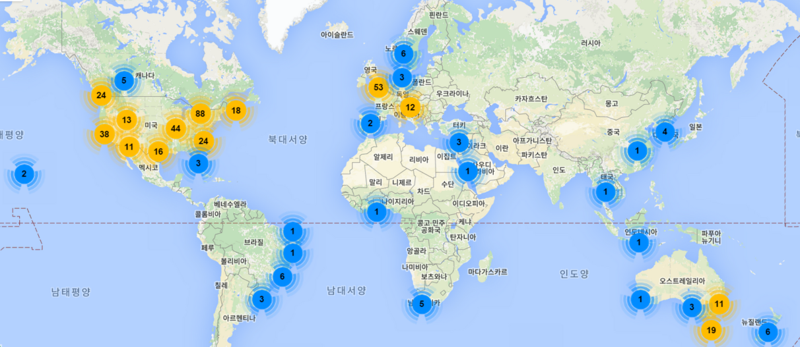

### 소프트웨어 카펜트리(Software Carpentry)란 무엇일까요?

국내에도 잘 알려진 [The Architecture of Open Source Applications](http://aosabook.org/en/index.html) 책의 편집자로 더 많이 알려진 그렉 윌슨(Greg Wilson) 박사님이 주도하여 추진된 [소프트웨어 카펜트리(Software Carpentry)](http://software-carpentry.org/)는 1998년부터 시작된 무료 소프트웨어 교육 프로그램이다. 특히, 가설검증이나 모형 개발을 위한 대부분의 통계 프로젝트에서 데이터 처리 작업이 대략 10%정도 크지 않은 부분을 차지하지만 80% 이상 시간이 엑셀, SQL, 유닉스 쉘 스크립트 작성 등으로 쓰여지고 있는 것이 사실이다. 과학과 공학 연구자들이 대부분의 시간을 컴퓨터로 시뮬레이션하고 데이터를 분석하며 귀중한 시간을 보내지만 제대로 된 소프트웨어 교육을 받은 사람도 드물고, 가르칠 수 있는 사람도 부족한 현실에서 소프트웨어 카펜트리 프로젝트는 과학 및 기술 종사자가 본연의 업무에 집중하는데 큰 도움을 주고 있다.

통계가 폭넓게 쓰이고 있는 과학과 기술분야 뿐만 아니라 총성없는 전쟁을 하는 사업 및 산업분야에 소프트웨어 카펜트리가 필요한 이유는 뭘까. 꿈과 현실에 괴리가 너무나 크기 때문이다.

- **[꿈]** 컴퓨터가 연구를 혁명적으로 바꾸었고, 혁명은 지금 시작단계다. 매일 전세계 과학자와 공학자들이 너무 크거가, 너무 작거나, 너무 빠르거나, 너무 비싸거나, 너무 위험하거나, 혹은 너무 어려워서 어느 방식이든지 어려운 문제들을 연구하기 위해서 컴퓨터를 사용한다.
- **[현실]** 매일 전세계 과학자들과 공학자들이 컴퓨터와 씨름하면서 시간을 낭비하고 있다. 얼마 걸리지 않을 작업을 몇시간, 몇일이 걸려 작업하지만, 많은 것들은 결코 동작하지 않는다. 그리고 심지어 동작을 해도, 결과가 얼마의 신뢰성을 갖는지에 대해 많은 과학자들이 확신을 하지 못한다.

[소프트웨어 카펜트리 소개 슬라이드](http://statkclee.github.io/slideshows-2015-02-15/00-common/00.swc/introducing-software-carpentry/index.html#slide-0")

소프트웨어를 누구나 배워야 되고 이를 통해서 생산성이 20% 이상 높아질 수 있습니다. 생산성 20%는 주5일 근무에 하루 이상을 벌 수 있는 시간이고, 매월 4일 1년으로 치면 52일 입니다.어떻게 가능하냐구요? 사람이 못하고 컴퓨터가 잘하는 일을 컴퓨터에 시키면 됩니다. 단 2일간의 워크샵을 통해서 시간을 벌어가세요.

[Software Carpentry](http://software-carpentry.org/)의 미션은 좀더 생산적으로 연구를 수행하기 위해서 과학, 공학, 의학 분야의 지식근로자에게 과학 컴퓨팅(scientific computing) 기본적인 기술을 가르친다. 종종 과학기술분야 종사자분들이 상당한 시간을 소프트웨어 개발에 씨름하면서 보내지만, 대부분의 프로그래머는 거의 혼자서 독한한다. 결과로, 몇분이면 끝날 작업에 수시간을 소비하고, 예를 들면, 바퀴를 다시 발명하는 것처럼 다시 작성할 필요가 없는데 시간을 낭비하고, 여전히 개발한 산출물에 신빙성을 담보할 수 없다. 이 문제를 정면으로 다루기 위해서, 소프트웨어 카펜트리(Software Carpentry)는 [전세계 수백개 거점](http://software-carpentry.org/workshops/previous.html)에서 2일간 실습위주 워크샵을 진행한다.

단, 2일간 실습위주(hands-on) 워크숍 교육을 통해서 프로그램 설계, 버젼 제어, 데이터 관리, 작업 자동화를 포함한 기본 개념과 도구를 실습위주로 학습한다. 모든 워크샵 참여자가 서로 돕고 학습한 것을 본인 업무에 적용하길 기대합니다.

### 좀더 자세히 살펴볼까요.

연구자들이 느끼는 대부분의 고통은 체계적으로 소프트웨어를 어떻게 개발하는지, 만약 프로그램이 잘 동작한다면 어떻게 작업결과를 전자우편을 통해서 전달하는 것을 제외하고 동료와 공유하는지, 혹은 지금까지 연구한 것을 어떻게 기록하는지 잘 모른다는 사실에 기인하다. 이러한 유감스러운 문제가 지속되는 이유는 다음 4가지에 기인한다고 추정한다.

- **시간과 공간이 없고(No room, no time), 이미 모든 사람의 교육과정은 꽉 차 있다.** – 단순하게 다른 교육과정을 빼지 않고 컴퓨팅에 대해서 추가할 공간이 없다.
- **표준이 없다(No standards)** – 검수자와 연구기금을 관리하는 기관에서 소프트웨어를 제대로 작성한 것인지 확인하지 않고 있으며, 프로그램을 작성하는데 얼마나 걸리는지 혹은 임기까지 계산하지도 않는다. 그래서 과학자들이 더 잘 할 아무런 동기가 없다.
- **장님이 장님을 인도한다(The blind leading the blind)** – 선임 연구자는 본인 스스로 어떻게 하는지도 모르는 것을 다음 세대 연구자에게 어떻게 하라고 가르칠 수는 없다.
- **대형 메인프레임 컴퓨터 숭배(The cult of big iron)** – 거의 모든 사람들이 사용하는 기본적인 기술보다는 정치가와 대학 총장이 첫 날 자랑하는 것에 관심과 자금 대부분이 들어간다.

통계가 폭넓게 과학과 기술분야에서 소프트웨어를 잘 활용하여 과학자들이 본연의 업무에 집중하고는데 도움이 되고자 시작하였고, 한국에서는 [xwMOOC](http://www.xwmooc.net)에서 ’14년부터 번역작업을 시작해서 올해 완역을 해서 HTML, PDF, ePUB 등 다양한 형식으로 교육 콘텐츠를 제공하여 스마트폰, 태블릿, PC 에서도 무료로 자유로이 활용가능하다.

소프트웨어 카펜트리에서는 유닉스 쉘을 이용한 작업자동화, 버젼관리와 협업을 위한 Git/GitHub, 추상화 모듈방식 프로그래밍으로 파이썬과 R, 데이터 관리를 위한 SQL을 핵심 교육내용으로 이틀동안 실습 중심으로 워크샵으로 진행한다. '14년에만 전세계적으로 130개 워크샵에 4,500명이 참석하여 활발하게 진행되고 있다. 한국에서도 '15년도 총 4회 워크샵을 개최하였고, 내년 워크샵을 위한 준비를 착실히 추진하고 있다.

- [파이콘 2015 라이트닝 토크](http://www.pycon.kr/2015/program/77)
    * [한국에서 소프트웨어 카펜트리 1년...](http://statkclee.github.io/slideshows/korea/index.html)  
- 소프트웨어 카펜트리 교재
    *  [GitHub 저장소](https://github.com/statkclee/swcarpentry-version-5-3-new)
    *  [xwMOOC 소프트웨어 카펜트리](http://swcarpentry.xwmooc.org/)
- 소프트웨어 카펜트리 워크샵
    *  [한국전파진흥협회(RAPA)](http://statkclee.github.io/2015-02-25-seoul/)
    *  [경기콘텐츠코리아랩](http://statkclee.github.io/2015-04-29-pangyo/)
    *  [연세대학교](http://statkclee.github.io/2015-06-29-yonsei/)
    *  [나노종합기술원 대전창조경제혁신센터](http://statkclee.github.io/2015-08-20-daejeon/)

